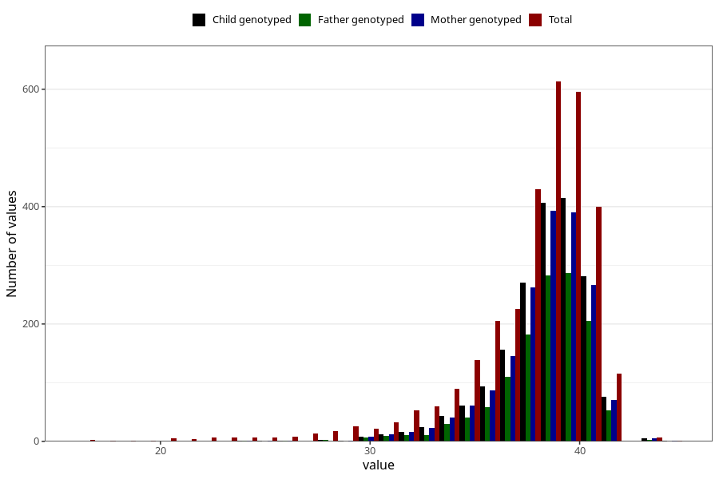

# pregnancy_duration_art_weeks
Variable mapping to questionnaire: mfr, question SVLEN_ART.
- Number of values:

| Value | Total | Child genotyped | Mother genotyped | Father genotyped |
| ----- | ----- | --------------- | ---------------- | ---------------- |
| Missing | 110529 | 73558 | 69985 | 48925 |
| Non-missing | 3094 | 1873 | 1784 | 1293 |
| 25th percentile | 37 | 38 | 38 | 38 |
| 50th percentile | 39 | 39 | 39 | 39 |
| 75th percentile | 40 | 40 | 40 | 40 |

