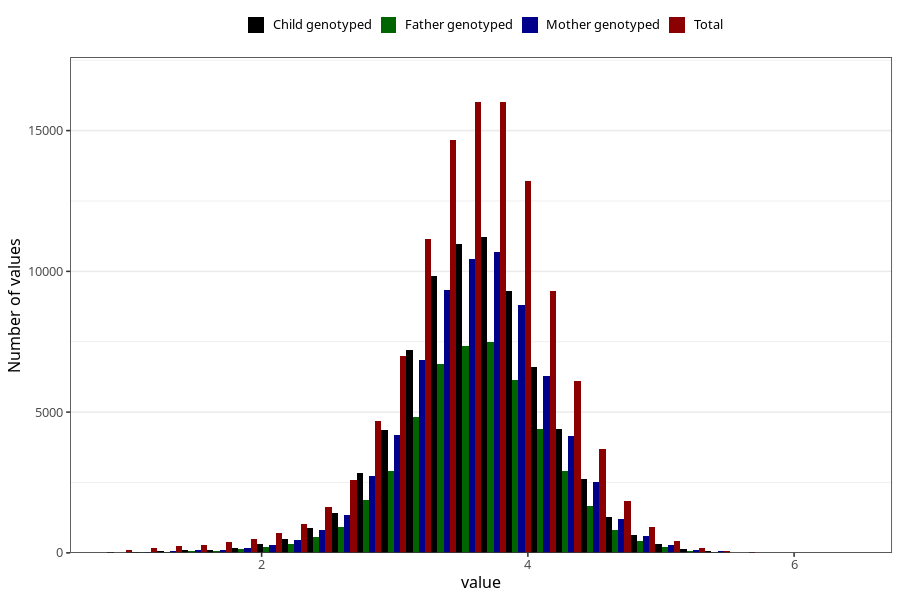

# weight_birth
Variable mapping to questionnaire: mfr, question VEKT.
- Number of values:

| Value | Total | Child genotyped | Mother genotyped | Father genotyped |
| ----- | ----- | --------------- | ---------------- | ---------------- |
| Missing | 767 | 59 | 57 | 39 |
| Non-missing | 112856 | 75372 | 71712 | 50179 |
| 25th percentile | 3.24 | 3.29 | 3.29 | 3.295 |
| 50th percentile | 3.59 | 3.63 | 3.63 | 3.62 |
| 75th percentile | 3.94 | 3.96 | 3.96 | 3.96 |

