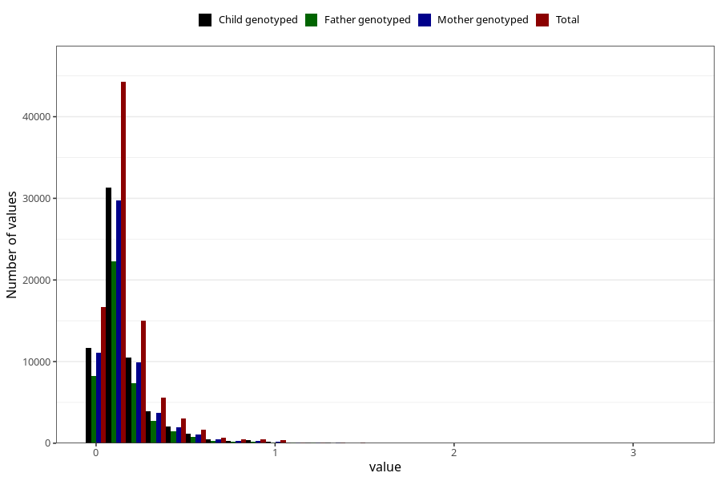

# food_epa_g_day
Variable mapping to questionnaire: q2_fatty_acid_iodine, question f_epa.
- Number of values:

| Value | Total | Child genotyped | Mother genotyped | Father genotyped |
| ----- | ----- | --------------- | ---------------- | ---------------- |
| Missing | 24927 | 13198 | 12674 | 6238 |
| Non-missing | 88696 | 62233 | 59095 | 43980 |
| 25th percentile | 0.0682 | 0.0683 | 0.0682 | 0.0686 |
| 50th percentile | 0.1162 | 0.1158 | 0.1157 | 0.1159 |
| 75th percentile | 0.1946 | 0.1932 | 0.1928 | 0.1918 |

