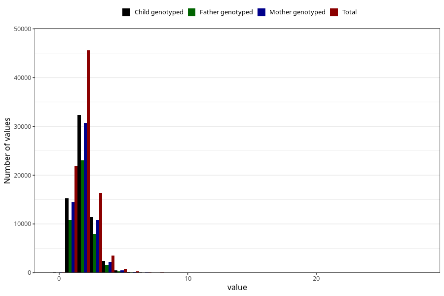

# riboflavin
Variable mapping to questionnaire: q2_cwd_calculations, question RIBOFLAVIN.
- Number of values:

| Value | Total | Child genotyped | Mother genotyped | Father genotyped |
| ----- | ----- | --------------- | ---------------- | ---------------- |
| Missing | 24927 | 13198 | 12674 | 6238 |
| Non-missing | 88696 | 62233 | 59095 | 43980 |
| 25th percentile | 1.44 | 1.44 | 1.44 | 1.44 |
| 50th percentile | 1.84 | 1.84 | 1.84 | 1.83 |
| 75th percentile | 2.36 | 2.34 | 2.34 | 2.33 |

