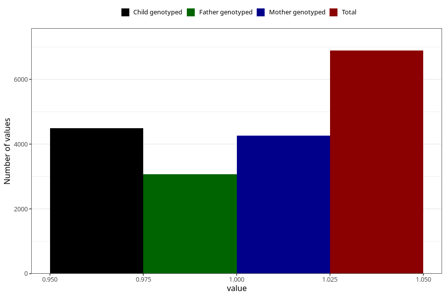

# blood_haemoglobin_dont_know_30w
Variable mapping to questionnaire: q3, question CC130.
- Number of values:

| Value | Total | Child genotyped | Mother genotyped | Father genotyped |
| ----- | ----- | --------------- | ---------------- | ---------------- |
| Missing | 106735 | 70932 | 67512 | 47149 |
| Non-missing | 6888 | 4499 | 4257 | 3069 |
| 1 | 6888 | 4499 | 4257 | 3069 |

