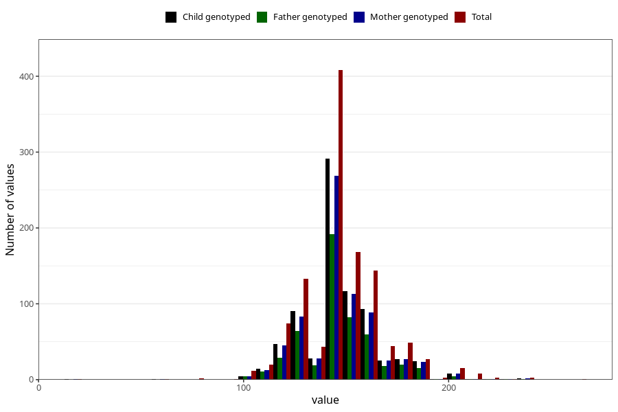

# highest_blood_pressure_before_pregnancy_systolic
Variable mapping to questionnaire: q3, question CC118.
- Number of values:

| Value | Total | Child genotyped | Mother genotyped | Father genotyped |
| ----- | ----- | --------------- | ---------------- | ---------------- |
| Missing | 112462 | 74655 | 71034 | 49695 |
| Non-missing | 1161 | 776 | 735 | 523 |
| 25th percentile | 140 | 140 | 140 | 140 |
| 50th percentile | 143 | 140 | 140 | 140 |
| 75th percentile | 160 | 155 | 155 | 155 |

