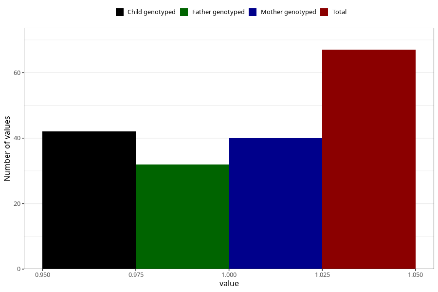

# hospitalized_bleeding_17_20w
Variable mapping to questionnaire: q3, question CC151.
- Number of values:

| Value | Total | Child genotyped | Mother genotyped | Father genotyped |
| ----- | ----- | --------------- | ---------------- | ---------------- |
| Missing | 113556 | 75389 | 71729 | 50186 |
| Non-missing | 67 | 42 | 40 | 32 |
| 1 | 67 | 42 | 40 | 32 |

