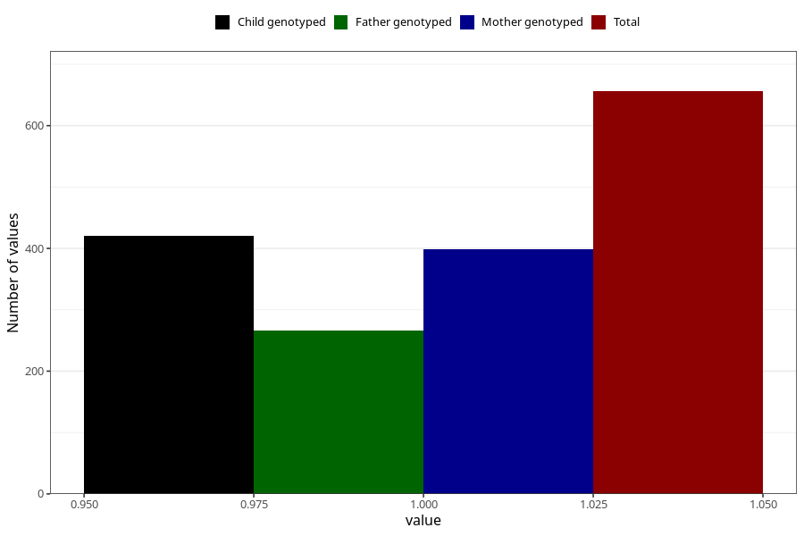

# oedema_5w_8w
Variable mapping to questionnaire: q1m, question AA317.
- Number of values:

| Value | Total | Child genotyped | Mother genotyped | Father genotyped |
| ----- | ----- | --------------- | ---------------- | ---------------- |
| Missing | 112967 | 75010 | 71370 | 49952 |
| Non-missing | 656 | 421 | 399 | 266 |
| 1 | 656 | 421 | 399 | 266 |

