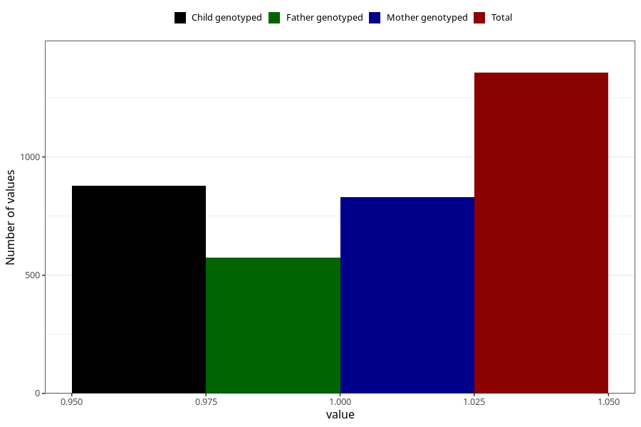

# oedema_9w_12w
Variable mapping to questionnaire: q1m, question AA318.
- Number of values:

| Value | Total | Child genotyped | Mother genotyped | Father genotyped |
| ----- | ----- | --------------- | ---------------- | ---------------- |
| Missing | 112267 | 74554 | 70938 | 49644 |
| Non-missing | 1356 | 877 | 831 | 574 |
| 1 | 1356 | 877 | 831 | 574 |

