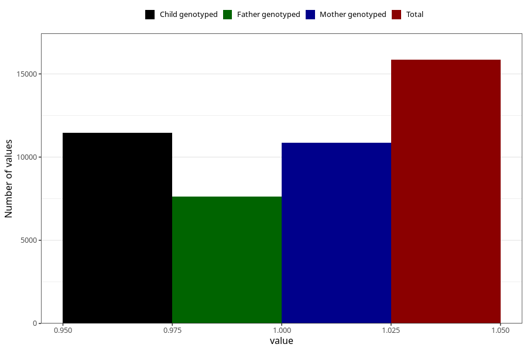

# pelvic_girdle_pain_17w_20w
Variable mapping to questionnaire: q3, question CC341.
- Number of values:

| Value | Total | Child genotyped | Mother genotyped | Father genotyped |
| ----- | ----- | --------------- | ---------------- | ---------------- |
| Missing | 97773 | 63987 | 60899 | 42596 |
| Non-missing | 15850 | 11444 | 10870 | 7622 |
| 1 | 15850 | 11444 | 10870 | 7622 |

