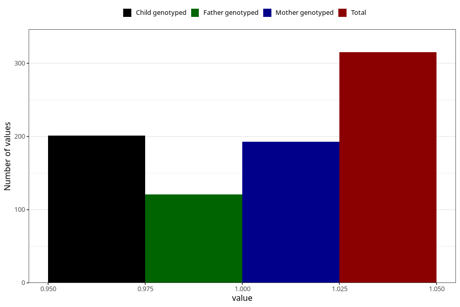

# pneumonia_bronchitis_5w_8w
Variable mapping to questionnaire: q1m, question AA387.
- Number of values:

| Value | Total | Child genotyped | Mother genotyped | Father genotyped |
| ----- | ----- | --------------- | ---------------- | ---------------- |
| Missing | 113308 | 75230 | 71576 | 50097 |
| Non-missing | 315 | 201 | 193 | 121 |
| 1 | 315 | 201 | 193 | 121 |

