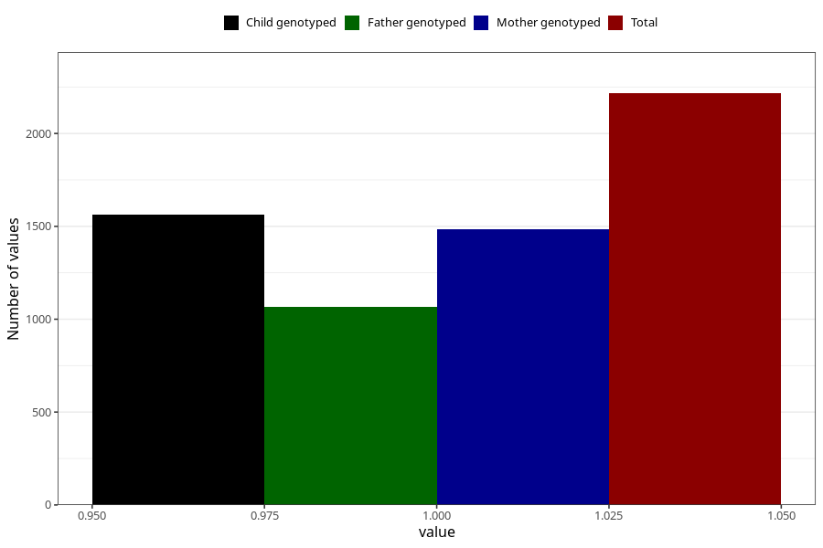

# vaginal_catarrh_unusual_discharge_after_29w
Variable mapping to questionnaire: q3, question CC416.
- Number of values:

| Value | Total | Child genotyped | Mother genotyped | Father genotyped |
| ----- | ----- | --------------- | ---------------- | ---------------- |
| Missing | 111407 | 73869 | 70285 | 49150 |
| Non-missing | 2216 | 1562 | 1484 | 1068 |
| 1 | 2216 | 1562 | 1484 | 1068 |

