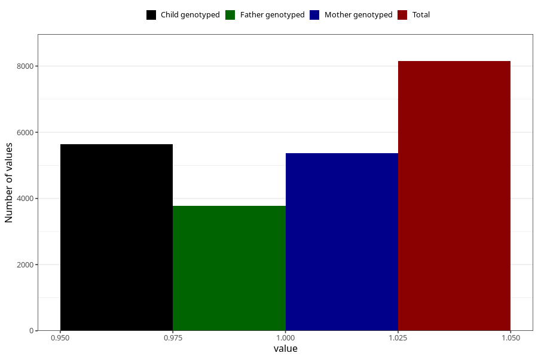

# vaginal_thrush_13w_15w
Variable mapping to questionnaire: q1m, question AA239.
- Number of values:

| Value | Total | Child genotyped | Mother genotyped | Father genotyped |
| ----- | ----- | --------------- | ---------------- | ---------------- |
| Missing | 105474 | 69791 | 66393 | 46435 |
| Non-missing | 8149 | 5640 | 5376 | 3783 |
| 1 | 8149 | 5640 | 5376 | 3783 |

