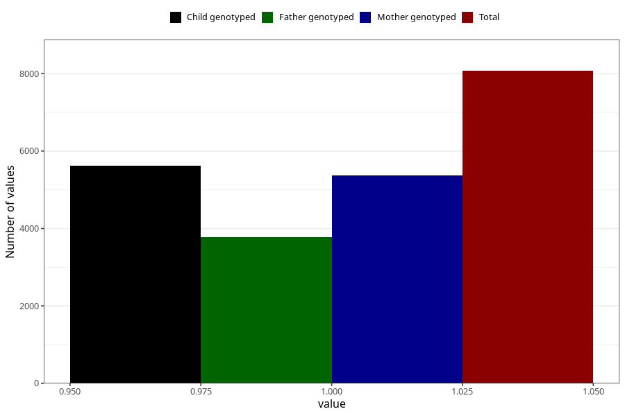

# vaginal_thrush_9w_12w
Variable mapping to questionnaire: q1m, question AA238.
- Number of values:

| Value | Total | Child genotyped | Mother genotyped | Father genotyped |
| ----- | ----- | --------------- | ---------------- | ---------------- |
| Missing | 105552 | 69810 | 66405 | 46448 |
| Non-missing | 8071 | 5621 | 5364 | 3770 |
| 1 | 8071 | 5621 | 5364 | 3770 |

