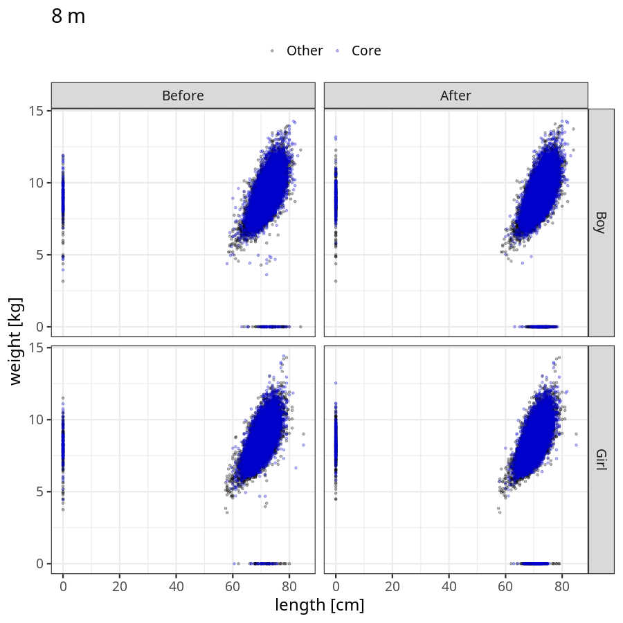
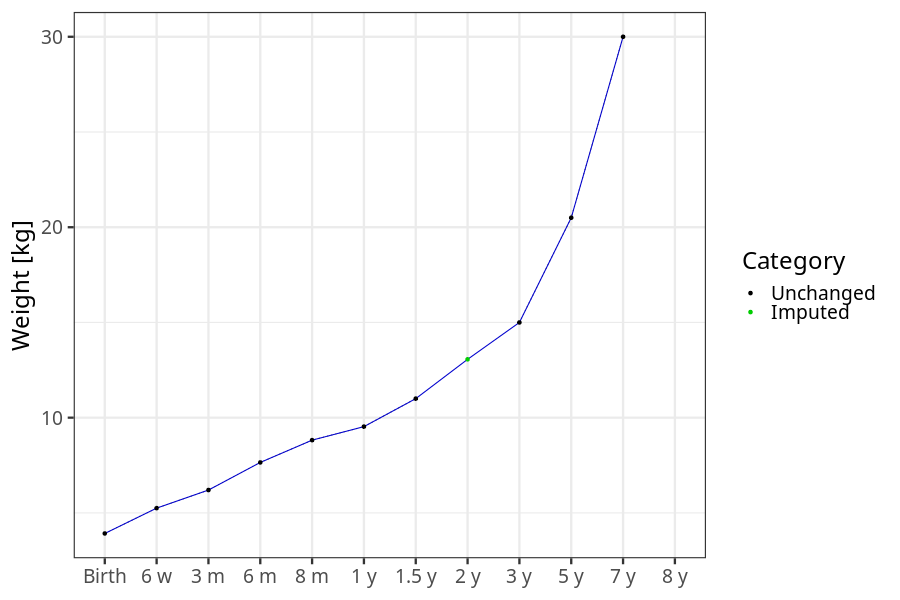
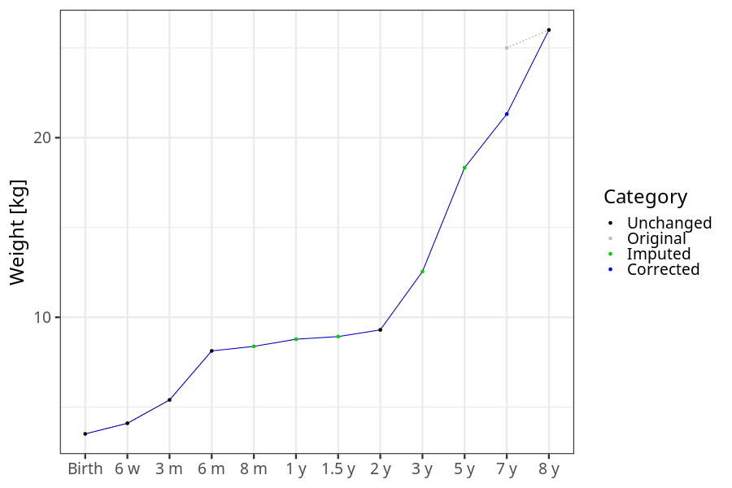
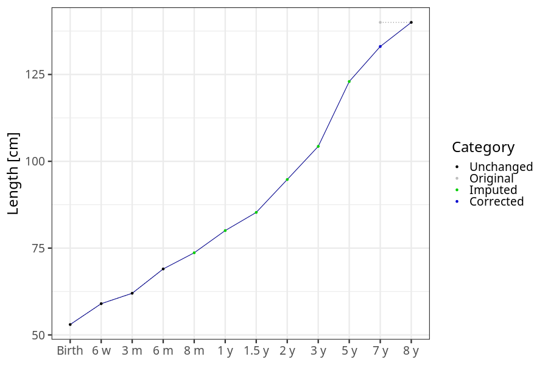
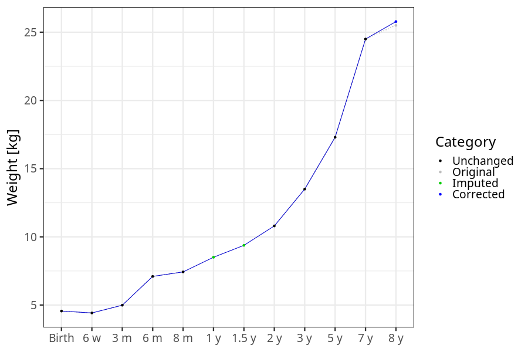

# Phenotypes
### Number of values

### Length vs weight

### Imputation
- Children with no data point altered: 68720
- Children with at least one data point altered: 44903
#### Random example: 86652
> imputed@length_16m imputed@length_2y imputed@weight_16m imputed@weight_2y

#### Random example: 66892
> imputed@length_16m imputed@length_2y imputed@weight_16m imputed@weight_2y

#### Random example: 9253
> imputed@length_16m imputed@length_2y imputed@weight_16m imputed@weight_2y

#### Random example: 80203
> imputed@length_16m imputed@length_2y imputed@weight_16m imputed@weight_2y

#### Random example: 17851
> imputed@length_16m imputed@length_2y imputed@weight_16m imputed@weight_2y

#### Random example: 1780
> imputed@length_16m imputed@length_2y imputed@weight_16m imputed@weight_2y

#### Random example: 100030
> imputed@length_16m imputed@length_2y imputed@weight_16m imputed@weight_2y

#### Random example: 97607
> imputed@length_16m imputed@length_2y imputed@weight_16m imputed@weight_2y

#### Random example: 45975
> imputed@length_16m imputed@length_2y imputed@weight_16m imputed@weight_2y

#### Random example: 83281
> imputed@length_16m imputed@length_2y imputed@weight_16m imputed@weight_2y

#### Random example: 96661
> imputed@length_16m imputed@length_2y imputed@weight_16m imputed@weight_2y

#### Random example: 103899
> imputed@length_16m imputed@length_2y imputed@weight_16m imputed@weight_2y

#### Random example: 80894
> imputed@length_16m imputed@length_2y imputed@weight_16m imputed@weight_2y

#### Random example: 47349
> imputed@length_16m imputed@length_2y imputed@weight_16m imputed@weight_2y

#### Random example: 107360
> imputed@length_16m imputed@length_2y imputed@weight_16m imputed@weight_2y

#### Random example: 83607
> imputed@length_16m imputed@length_2y imputed@weight_16m imputed@weight_2y

#### Random example: 55801
> imputed@length_16m imputed@length_2y imputed@weight_16m imputed@weight_2y

#### Random example: 26850
> imputed@length_16m imputed@length_2y imputed@weight_16m imputed@weight_2y

#### Random example: 60595
> imputed@length_16m imputed@length_2y imputed@weight_16m imputed@weight_2y

#### Random example: 38483
> imputed@length_16m imputed@length_2y imputed@weight_16m imputed@weight_2y

#### Most extreme example (1): 101841
> 

#### Most extreme example (2): 25682
> 

#### Most extreme example (3): 6680
> imputed@length_16m imputed@length_2y imputed@weight_16m imputed@weight_2y

#### Most extreme example (4): 97760
> imputed@length_16m imputed@length_2y imputed@weight_16m imputed@weight_2y

#### Most extreme example (5): 52165
> 

#### Most extreme example (6): 53844
> imputed@length_8m imputed@length_1y imputed@length_16m imputed@weight_8m imputed@weight_1y imputed@weight_16m

#### Most extreme example (7): 30076
> outlier@length_2y imputed@length_2y

#### Most extreme example (8): 35053
> 

#### Most extreme example (9): 491
> 

#### Most extreme example (10): 7350
> imputed@length_5y imputed@weight_5y

#### Most extreme example (11): 48448
> 

#### Most extreme example (12): 60462
> imputed@weight_6m imputed@weight_8m imputed@weight_16m

#### Most extreme example (13): 100845
> imputed@length_16m imputed@length_2y imputed@weight_16m imputed@weight_2y

#### Most extreme example (14): 37714
> 

#### Most extreme example (15): 35908
> 

#### Most extreme example (16): 27565
> outlier@weight_1y imputed@weight_1y imputed@weight_2y

#### Most extreme example (17): 110319
> 

#### Most extreme example (18): 15456
> 

#### Most extreme example (19): 4981
> imputed@length_16m imputed@length_2y imputed@weight_16m imputed@weight_2y

#### Most extreme example (20): 100571
> 

