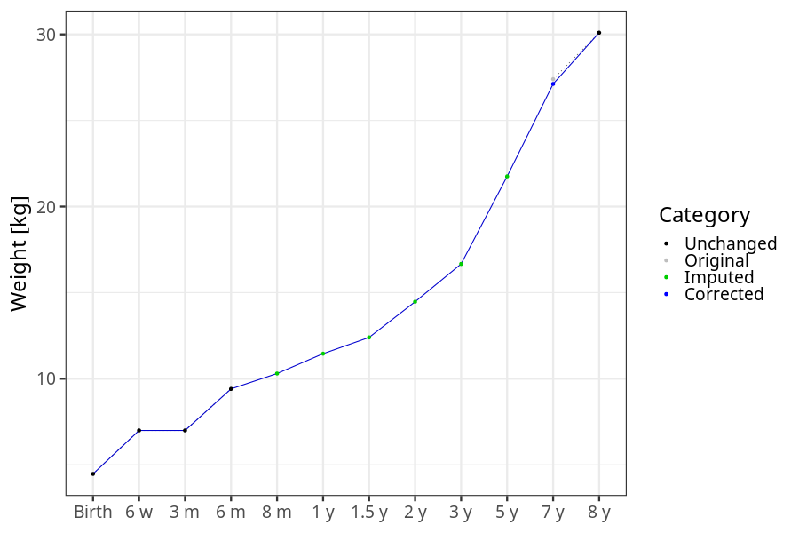
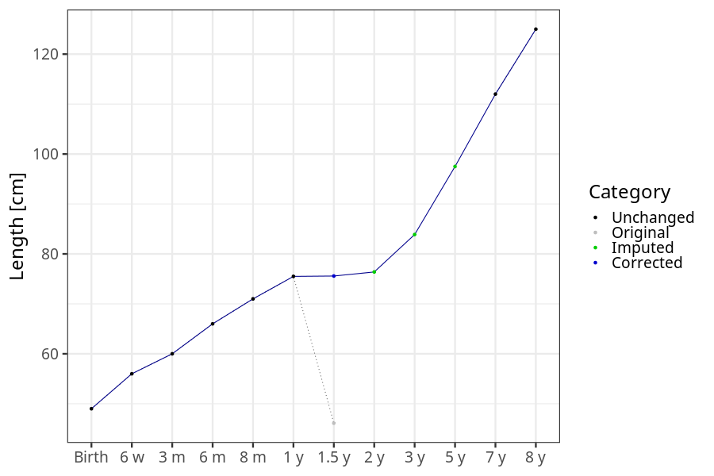
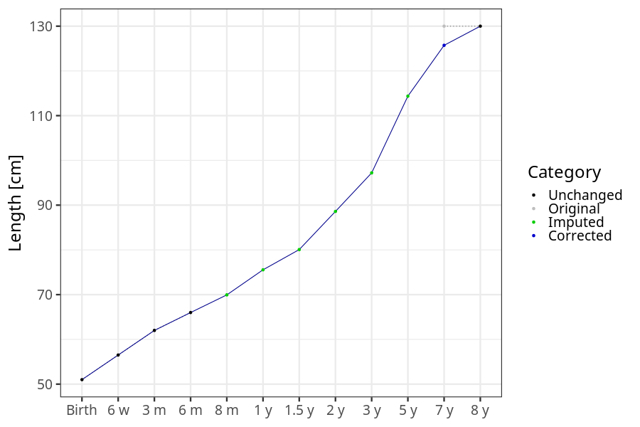
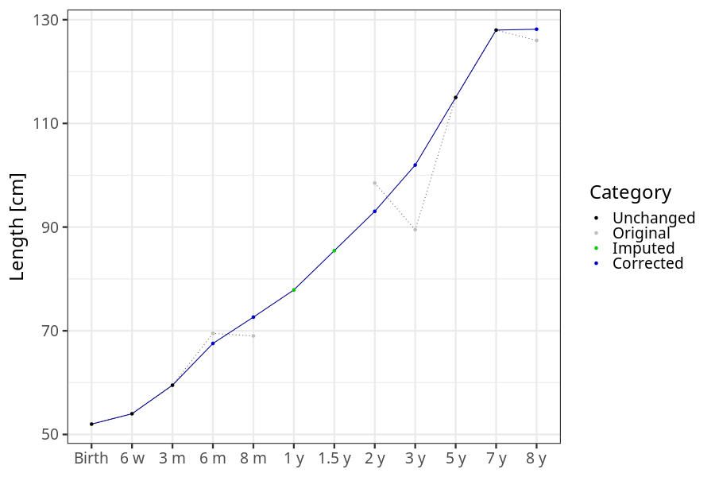

# Phenotypes
### Number of values

### Length vs weight

### Imputation
- Children with no data point altered: 68720
- Children with at least one data point altered: 44903
#### Random example: 15199
> imputed@length_16m imputed@length_2y imputed@weight_16m imputed@weight_2y

#### Random example: 209
> imputed@length_16m imputed@length_2y imputed@weight_16m imputed@weight_2y

#### Random example: 7181
> imputed@length_16m imputed@length_2y imputed@weight_16m imputed@weight_2y

#### Random example: 44595
> imputed@length_16m imputed@length_2y imputed@weight_16m imputed@weight_2y

#### Random example: 80257
> imputed@length_16m imputed@length_2y imputed@weight_16m imputed@weight_2y

#### Random example: 17586
> imputed@length_16m imputed@length_2y imputed@weight_16m imputed@weight_2y

#### Random example: 37559
> imputed@length_16m imputed@length_2y imputed@weight_16m imputed@weight_2y

#### Random example: 79831
> imputed@length_16m imputed@length_2y imputed@weight_16m imputed@weight_2y

#### Random example: 65058
> imputed@length_16m imputed@length_2y imputed@weight_16m imputed@weight_2y

#### Random example: 74763
> imputed@length_16m imputed@length_2y imputed@weight_16m imputed@weight_2y

#### Random example: 10572
> imputed@length_16m imputed@length_2y imputed@weight_16m imputed@weight_2y

#### Random example: 103166
> imputed@length_16m imputed@length_2y imputed@weight_16m imputed@weight_2y

#### Random example: 6390
> imputed@length_16m imputed@length_2y imputed@weight_16m imputed@weight_2y

#### Random example: 107054
> imputed@length_16m imputed@length_2y imputed@weight_16m imputed@weight_2y

#### Random example: 51579
> imputed@length_16m imputed@length_2y imputed@weight_16m imputed@weight_2y

#### Random example: 32237
> imputed@length_16m imputed@length_2y imputed@weight_16m imputed@weight_2y

#### Random example: 63773
> imputed@length_16m imputed@length_2y imputed@weight_16m imputed@weight_2y

#### Random example: 40914
> imputed@length_16m imputed@length_2y imputed@weight_16m imputed@weight_2y

#### Random example: 98656
> imputed@length_16m imputed@length_2y imputed@weight_16m imputed@weight_2y

#### Random example: 15630
> imputed@length_16m imputed@length_2y imputed@weight_16m imputed@weight_2y

#### Most extreme example (1): 98284
> 

#### Most extreme example (2): 82427
> 

#### Most extreme example (3): 101951
> imputed@length_16m imputed@length_2y imputed@weight_16m imputed@weight_2y

#### Most extreme example (4): 107742
> imputed@length_16m imputed@length_2y imputed@weight_16m imputed@weight_2y

#### Most extreme example (5): 62518
> 

#### Most extreme example (6): 7832
> imputed@length_8m imputed@length_1y imputed@length_16m imputed@weight_8m imputed@weight_1y imputed@weight_16m

#### Most extreme example (7): 108773
> outlier@length_2y imputed@length_2y

#### Most extreme example (8): 53592
> 

#### Most extreme example (9): 46891
> 

#### Most extreme example (10): 101600
> imputed@length_5y imputed@weight_5y

#### Most extreme example (11): 83620
> 

#### Most extreme example (12): 33121
> imputed@weight_6m imputed@weight_8m imputed@weight_16m

#### Most extreme example (13): 510
> imputed@length_16m imputed@length_2y imputed@weight_16m imputed@weight_2y

#### Most extreme example (14): 81725
> 

#### Most extreme example (15): 781
> 

#### Most extreme example (16): 110756
> outlier@weight_1y imputed@weight_1y imputed@weight_2y

#### Most extreme example (17): 94551
> 

#### Most extreme example (18): 94760
> 

#### Most extreme example (19): 76622
> imputed@length_16m imputed@length_2y imputed@weight_16m imputed@weight_2y

#### Most extreme example (20): 46991
> 

