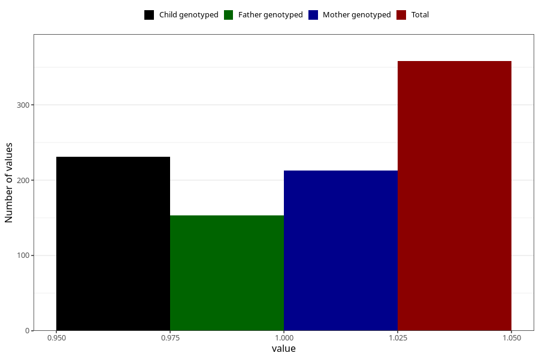

# abnormal_head_circumference_yes_18m
Variable mapping to questionnaire: q5, question EE812.
- Number of values:

| Value | Total | Child genotyped | Mother genotyped | Father genotyped |
| ----- | ----- | --------------- | ---------------- | ---------------- |
| Missing | 113265 | 75200 | 71556 | 50065 |
| Non-missing | 358 | 231 | 213 | 153 |
| 1 | 358 | 231 | 213 | 153 |

