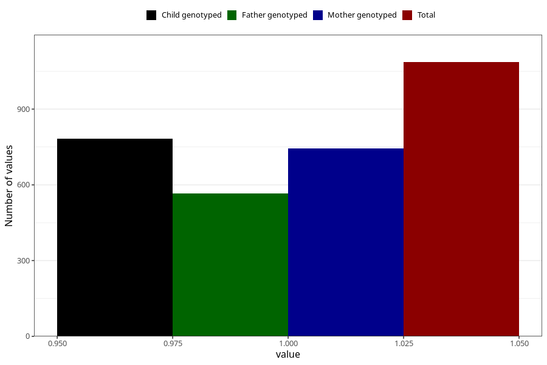

# asthma_previously_18m
Variable mapping to questionnaire: q5, question EE825.
- Number of values:

| Value | Total | Child genotyped | Mother genotyped | Father genotyped |
| ----- | ----- | --------------- | ---------------- | ---------------- |
| Missing | 112537 | 74648 | 71025 | 49653 |
| Non-missing | 1086 | 783 | 744 | 565 |
| 1 | 1086 | 783 | 744 | 565 |

