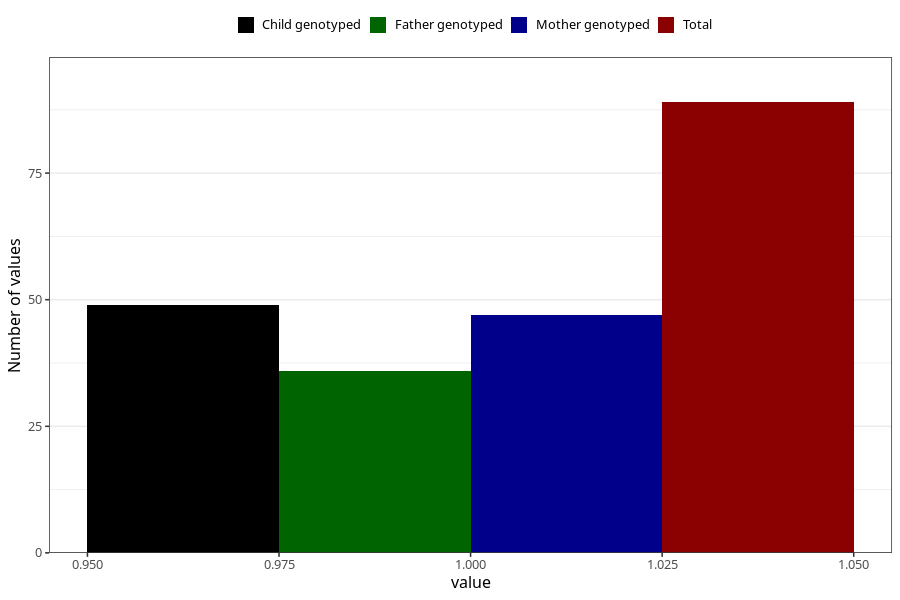

# cerebral_palsy_yes_3y
Variable mapping to questionnaire: q6, question GG42.
- Number of values:

| Value | Total | Child genotyped | Mother genotyped | Father genotyped |
| ----- | ----- | --------------- | ---------------- | ---------------- |
| Missing | 113534 | 75382 | 71722 | 50182 |
| Non-missing | 89 | 49 | 47 | 36 |
| 1 | 89 | 49 | 47 | 36 |

