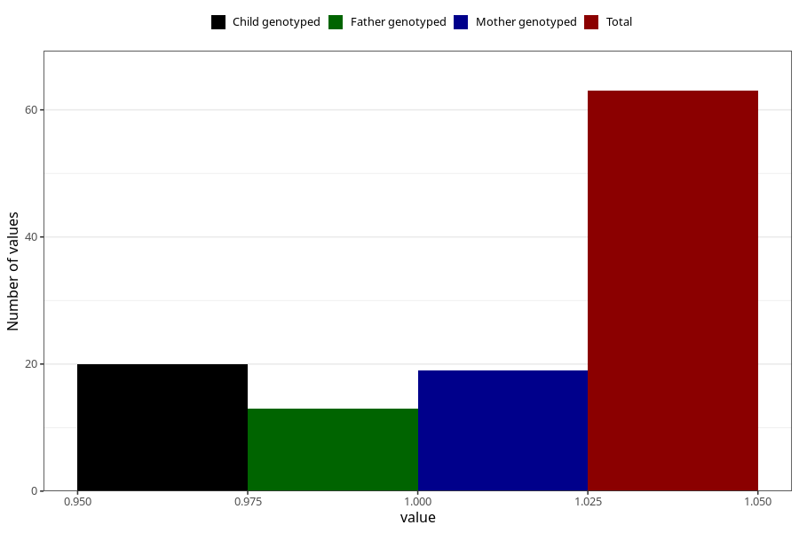

# chromosomal_defect_6m
Variable mapping to questionnaire: q4, question DD1111.
- Number of values:

| Value | Total | Child genotyped | Mother genotyped | Father genotyped |
| ----- | ----- | --------------- | ---------------- | ---------------- |
| Missing | 113560 | 75411 | 71750 | 50205 |
| Non-missing | 63 | 20 | 19 | 13 |
| 1 | 63 | 20 | 19 | 13 |

