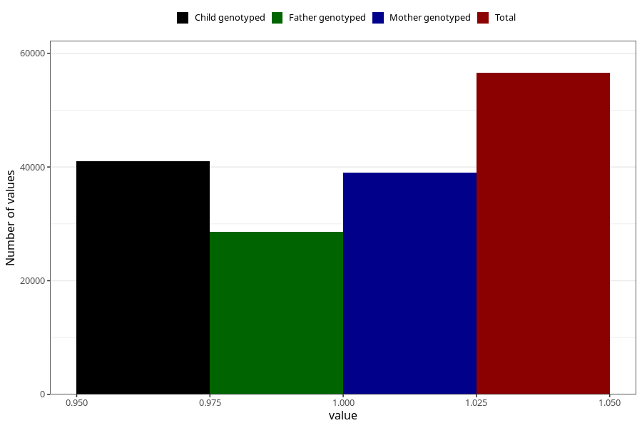

# delayed_motor_development_no_3y
Variable mapping to questionnaire: q6, question GG37.
- Number of values:

| Value | Total | Child genotyped | Mother genotyped | Father genotyped |
| ----- | ----- | --------------- | ---------------- | ---------------- |
| Missing | 57073 | 34376 | 32754 | 21583 |
| Non-missing | 56550 | 41055 | 39015 | 28635 |
| 1 | 56550 | 41055 | 39015 | 28635 |

