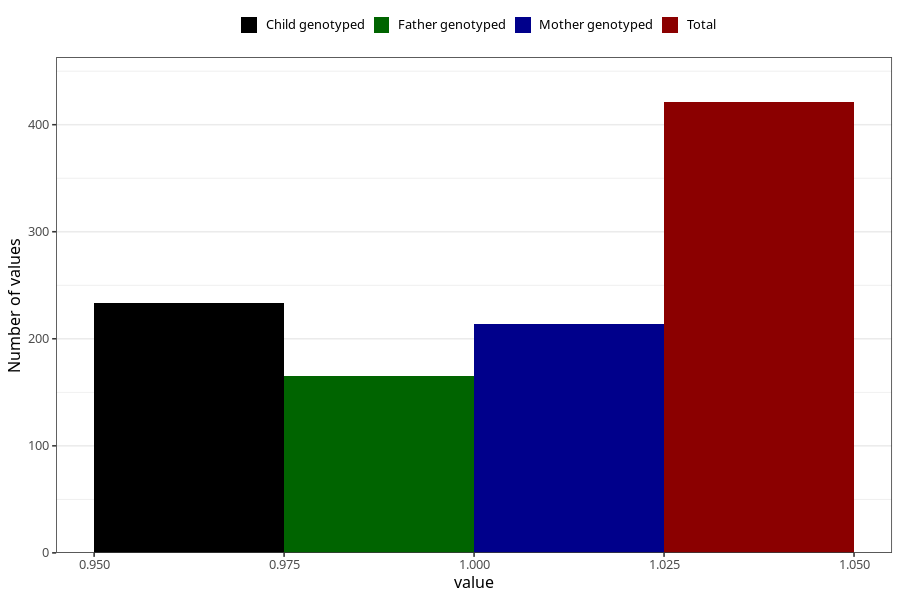

# delayed_motor_development_yes_3y
Variable mapping to questionnaire: q6, question GG38.
- Number of values:

| Value | Total | Child genotyped | Mother genotyped | Father genotyped |
| ----- | ----- | --------------- | ---------------- | ---------------- |
| Missing | 113202 | 75198 | 71555 | 50053 |
| Non-missing | 421 | 233 | 214 | 165 |
| 1 | 421 | 233 | 214 | 165 |

