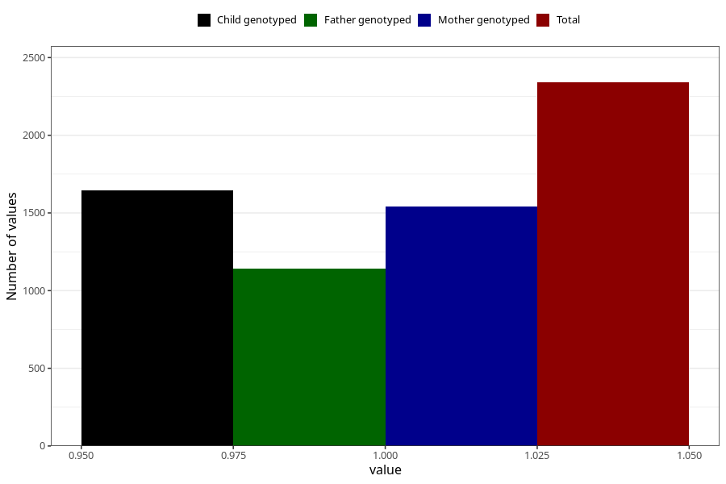

# delayed_or_abnormal_language_development_past_8y
Variable mapping to questionnaire: q9, question NN42.
- Number of values:

| Value | Total | Child genotyped | Mother genotyped | Father genotyped |
| ----- | ----- | --------------- | ---------------- | ---------------- |
| Missing | 111283 | 73787 | 70226 | 49075 |
| Non-missing | 2340 | 1644 | 1543 | 1143 |
| 1 | 2340 | 1644 | 1543 | 1143 |

