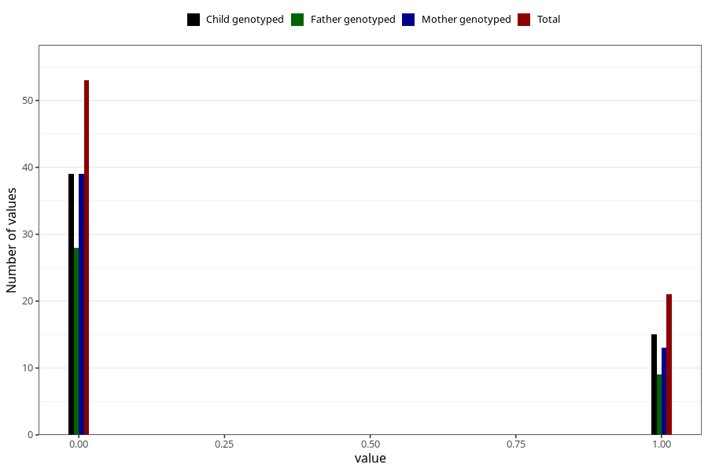

# encephalitis_meningitis_freq_3y
Variable mapping to questionnaire: q6, question GG156.
- Number of values:

| Value | Total | Child genotyped | Mother genotyped | Father genotyped |
| ----- | ----- | --------------- | ---------------- | ---------------- |
| Missing | 113549 | 75377 | 71717 | 50181 |
| Non-missing | 74 | 54 | 52 | 37 |
| 0 | 53 | 39 | 39 | 28 |
| 1 | 21 | 15 | 13 | 9 |

