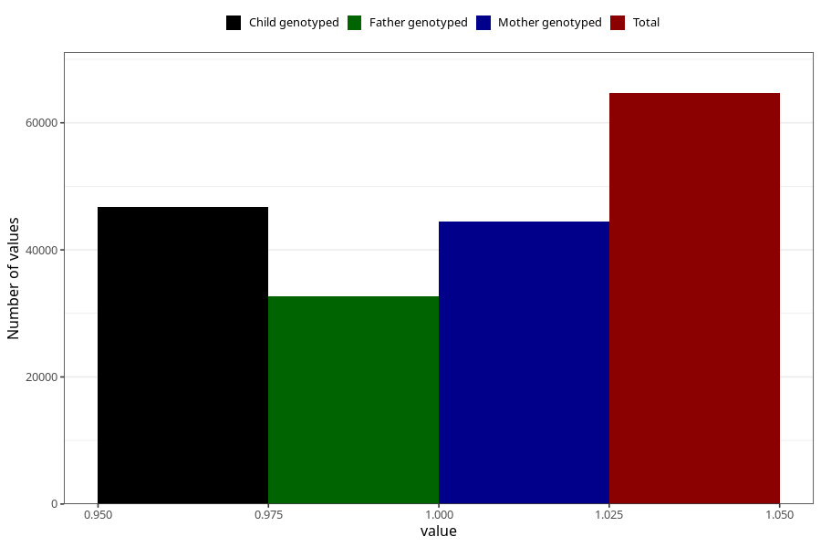

# food_allergy_intolerance_no_18m
Variable mapping to questionnaire: q5, question EE835.
- Number of values:

| Value | Total | Child genotyped | Mother genotyped | Father genotyped |
| ----- | ----- | --------------- | ---------------- | ---------------- |
| Missing | 48962 | 28708 | 27376 | 17464 |
| Non-missing | 64661 | 46723 | 44393 | 32754 |
| 1 | 64661 | 46723 | 44393 | 32754 |

