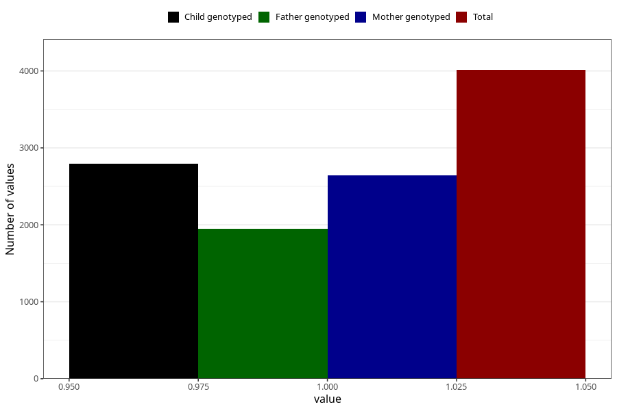

# food_allergy_intolerance_yes_18m
Variable mapping to questionnaire: q5, question EE836.
- Number of values:

| Value | Total | Child genotyped | Mother genotyped | Father genotyped |
| ----- | ----- | --------------- | ---------------- | ---------------- |
| Missing | 109611 | 72641 | 69124 | 48271 |
| Non-missing | 4012 | 2790 | 2645 | 1947 |
| 1 | 4012 | 2790 | 2645 | 1947 |

