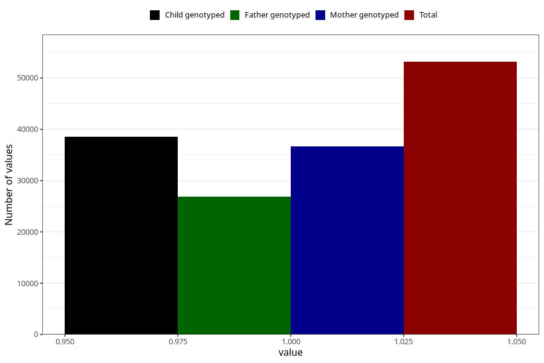

# food_allergy_no_3y
Variable mapping to questionnaire: q6, question GG85.
- Number of values:

| Value | Total | Child genotyped | Mother genotyped | Father genotyped |
| ----- | ----- | --------------- | ---------------- | ---------------- |
| Missing | 60466 | 36899 | 35145 | 23323 |
| Non-missing | 53157 | 38532 | 36624 | 26895 |
| 1 | 53157 | 38532 | 36624 | 26895 |

