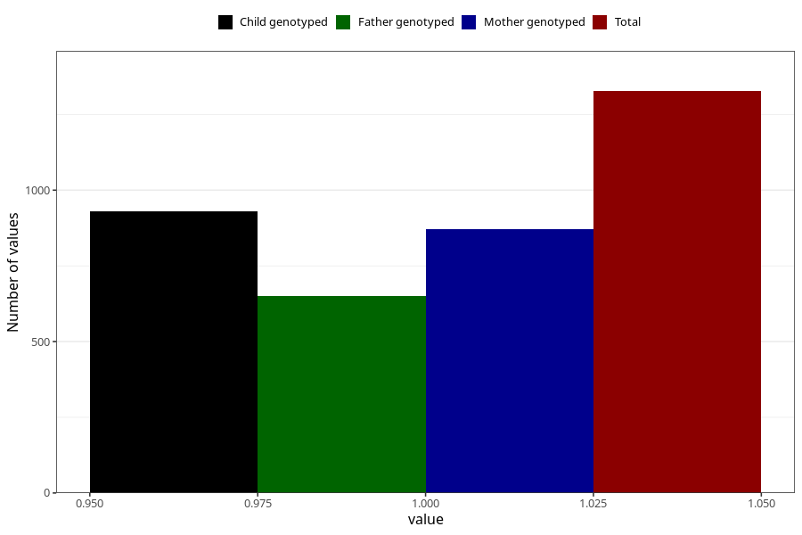

# food_allergy_previous_3y
Variable mapping to questionnaire: q6, question GG87.
- Number of values:

| Value | Total | Child genotyped | Mother genotyped | Father genotyped |
| ----- | ----- | --------------- | ---------------- | ---------------- |
| Missing | 112296 | 74501 | 70898 | 49568 |
| Non-missing | 1327 | 930 | 871 | 650 |
| 1 | 1327 | 930 | 871 | 650 |

