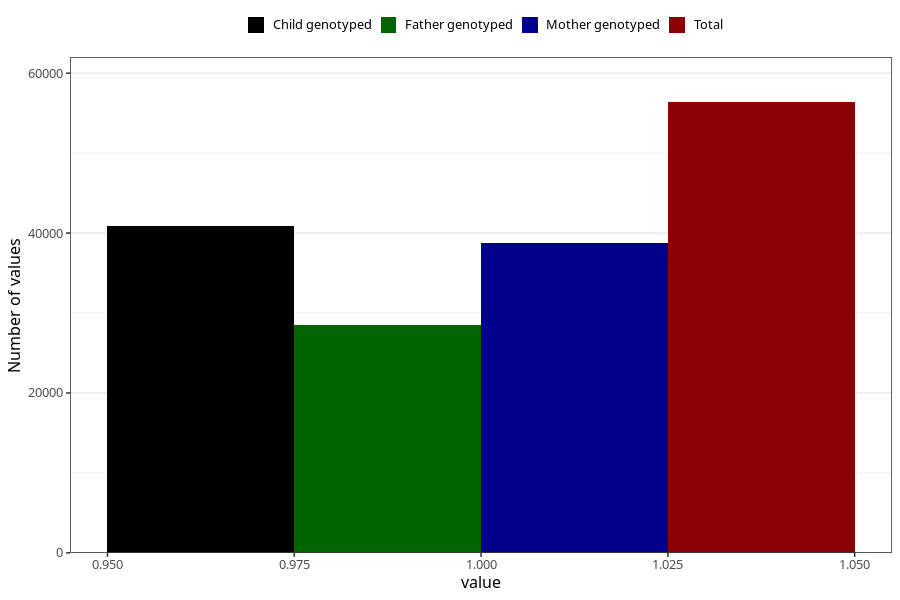

# heart_defect_no_3y
Variable mapping to questionnaire: q6, question GG61.
- Number of values:

| Value | Total | Child genotyped | Mother genotyped | Father genotyped |
| ----- | ----- | --------------- | ---------------- | ---------------- |
| Missing | 57255 | 34577 | 32952 | 21728 |
| Non-missing | 56368 | 40854 | 38817 | 28490 |
| 1 | 56368 | 40854 | 38817 | 28490 |

