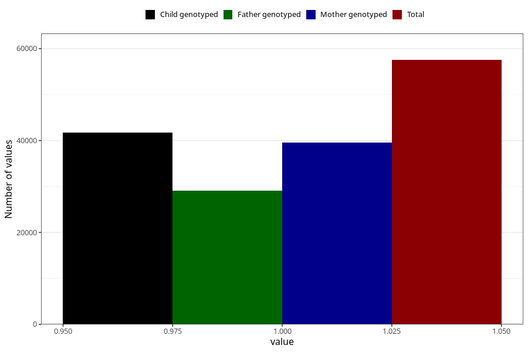

# hyperactivity_no_3y
Variable mapping to questionnaire: q6, question GG105.
- Number of values:

| Value | Total | Child genotyped | Mother genotyped | Father genotyped |
| ----- | ----- | --------------- | ---------------- | ---------------- |
| Missing | 56077 | 33739 | 32155 | 21143 |
| Non-missing | 57546 | 41692 | 39614 | 29075 |
| 1 | 57546 | 41692 | 39614 | 29075 |

