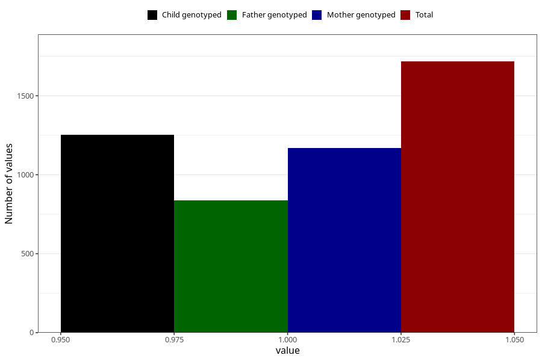

# impaired_hearing_previous_3y
Variable mapping to questionnaire: q6, question GG31.
- Number of values:

| Value | Total | Child genotyped | Mother genotyped | Father genotyped |
| ----- | ----- | --------------- | ---------------- | ---------------- |
| Missing | 111906 | 74178 | 70598 | 49380 |
| Non-missing | 1717 | 1253 | 1171 | 838 |
| 1 | 1717 | 1253 | 1171 | 838 |

