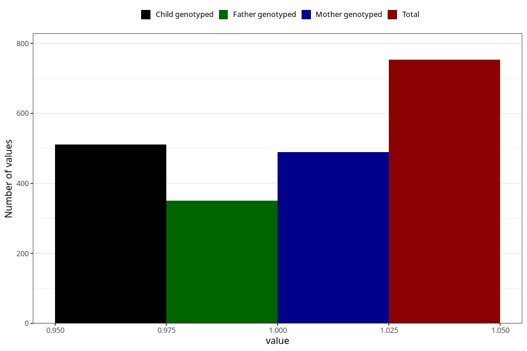

# impaired_hearing_yes_3y
Variable mapping to questionnaire: q6, question GG30.
- Number of values:

| Value | Total | Child genotyped | Mother genotyped | Father genotyped |
| ----- | ----- | --------------- | ---------------- | ---------------- |
| Missing | 112870 | 74920 | 71280 | 49867 |
| Non-missing | 753 | 511 | 489 | 351 |
| 1 | 753 | 511 | 489 | 351 |

