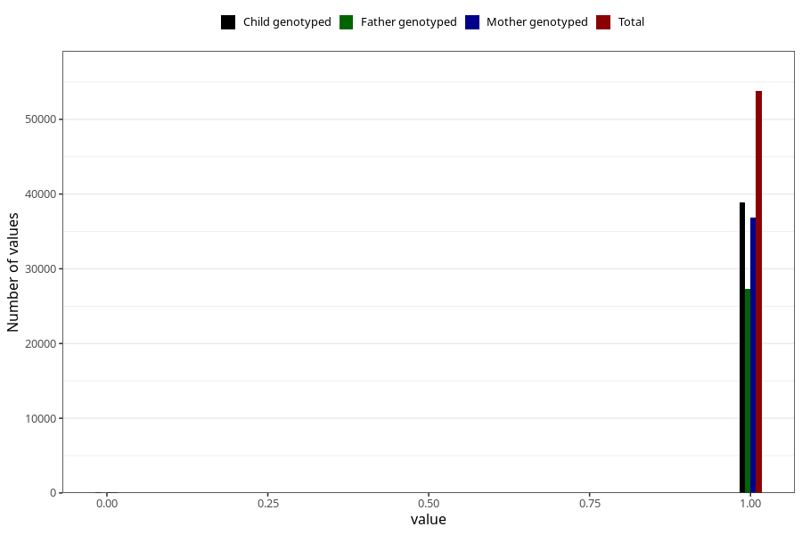

# other_gastrointestinal_problems_2_no_3y
Variable mapping to questionnaire: q6, question GG574.
- Number of values:

| Value | Total | Child genotyped | Mother genotyped | Father genotyped |
| ----- | ----- | --------------- | ---------------- | ---------------- |
| Missing | 59746 | 36513 | 34812 | 22809 |
| Non-missing | 53877 | 38918 | 36957 | 27409 |
| 0 | 102 | 67 | 63 | 44 |
| 1 | 53775 | 38851 | 36894 | 27365 |

