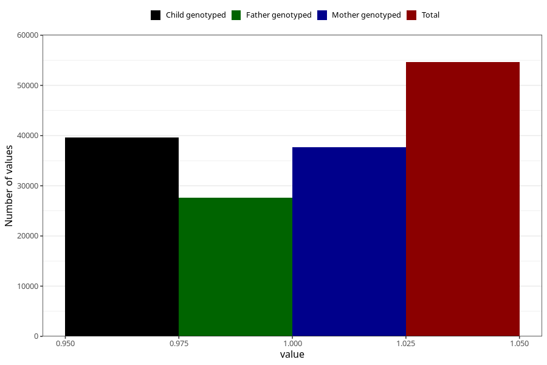

# other_longterm_illness_condition_no_3y
Variable mapping to questionnaire: q6, question GG113.
- Number of values:

| Value | Total | Child genotyped | Mother genotyped | Father genotyped |
| ----- | ----- | --------------- | ---------------- | ---------------- |
| Missing | 58991 | 35821 | 34124 | 22622 |
| Non-missing | 54632 | 39610 | 37645 | 27596 |
| 1 | 54632 | 39610 | 37645 | 27596 |

