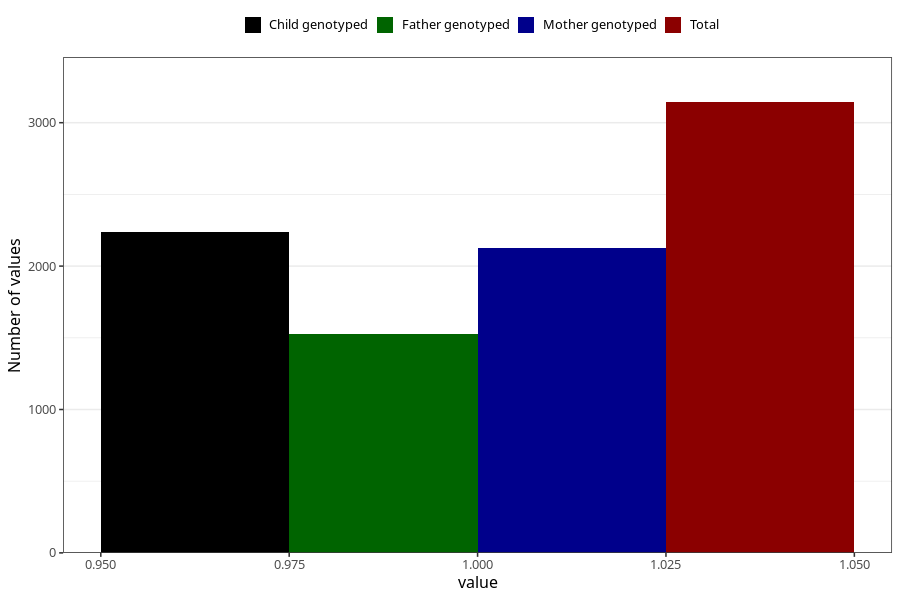

# sleep_problems_previously_18m
Variable mapping to questionnaire: q5, question EE845.
- Number of values:

| Value | Total | Child genotyped | Mother genotyped | Father genotyped |
| ----- | ----- | --------------- | ---------------- | ---------------- |
| Missing | 110480 | 73191 | 69644 | 48694 |
| Non-missing | 3143 | 2240 | 2125 | 1524 |
| 1 | 3143 | 2240 | 2125 | 1524 |

