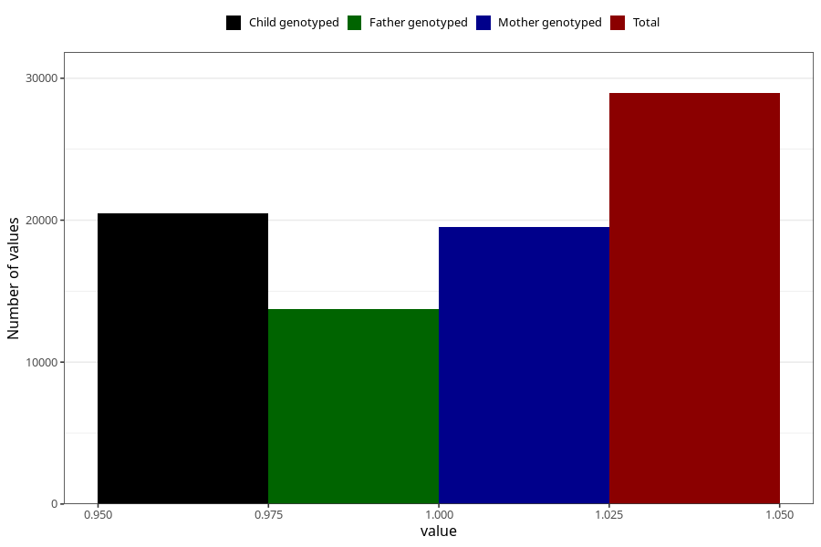

# formula_5m
- Number of values:

| Value | Total | Child genotyped | Mother genotyped | Father genotyped |
| ----- | ----- | --------------- | ---------------- | ---------------- |
| Missing | 84674 | 54937 | 52278 | 36494 |
| Non-missing | 28949 | 20494 | 19491 | 13724 |
| 1 | 28949 | 20494 | 19491 | 13724 |

