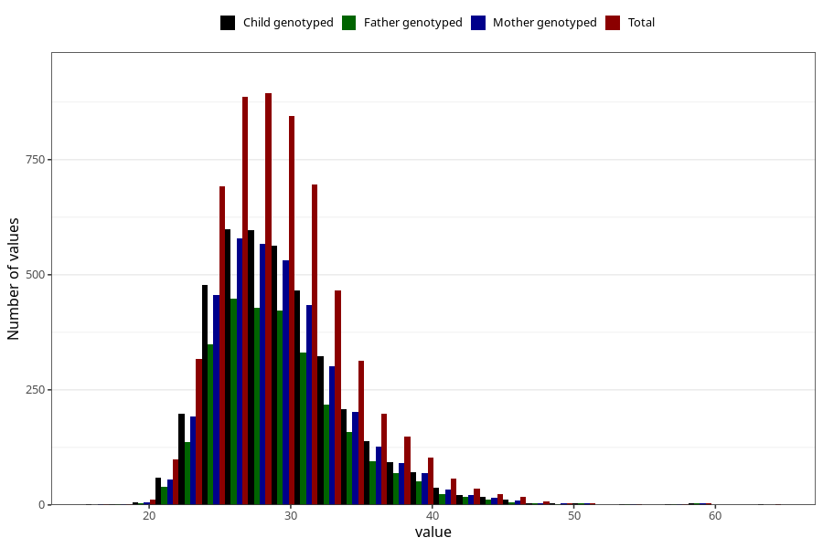

# mother_bmi_end
Variable mapping to questionnaire: mfr, question KMI_SLUTT.
- Number of values:

| Value | Total | Child genotyped | Mother genotyped | Father genotyped |
| ----- | ----- | --------------- | ---------------- | ---------------- |
| Missing | 107793 | 71528 | 68058 | 47390 |
| Non-missing | 5830 | 3903 | 3711 | 2828 |
| 25th percentile | 26.03 | 26.05 | 26.03 | 26.06 |
| 50th percentile | 28.67 | 28.69 | 28.63 | 28.67 |
| 75th percentile | 31.65 | 31.785 | 31.755 | 31.605 |

