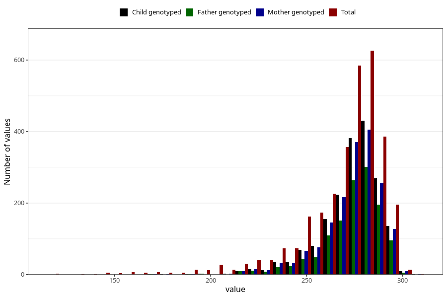

# pregnancy_duration_art
Variable mapping to questionnaire: mfr, question SVLEN_ART_DG.
- Number of values:

| Value | Total | Child genotyped | Mother genotyped | Father genotyped |
| ----- | ----- | --------------- | ---------------- | ---------------- |
| Missing | 110529 | 73558 | 69985 | 48925 |
| Non-missing | 3094 | 1873 | 1784 | 1293 |
| 25th percentile | 261 | 267 | 267 | 268 |
| 50th percentile | 275 | 277 | 277 | 277 |
| 75th percentile | 283 | 284 | 284 | 285 |

