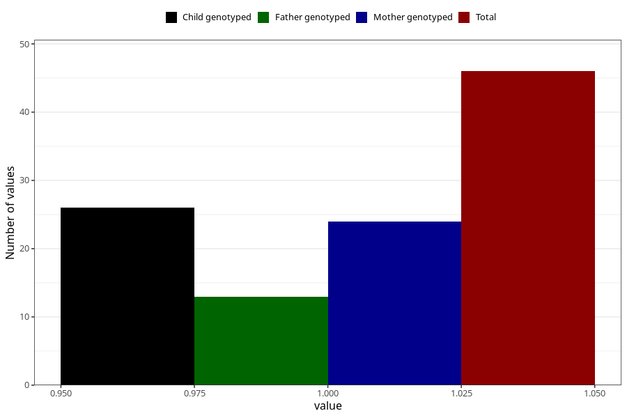

# amphetamine_during
Variable mapping to questionnaire: q1m, question AA1439.
- Number of values:

| Value | Total | Child genotyped | Mother genotyped | Father genotyped |
| ----- | ----- | --------------- | ---------------- | ---------------- |
| Missing | 113577 | 75405 | 71745 | 50205 |
| Non-missing | 46 | 26 | 24 | 13 |
| 1 | 46 | 26 | 24 | 13 |

