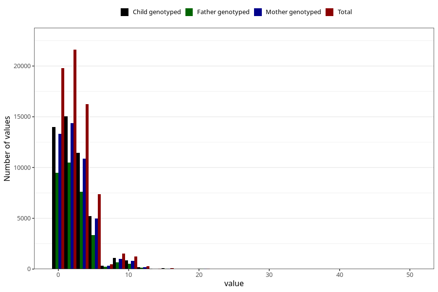

# coffee_before_filter
Variable mapping to questionnaire: q1m, question AA1377.
- Number of values:

| Value | Total | Child genotyped | Mother genotyped | Father genotyped |
| ----- | ----- | --------------- | ---------------- | ---------------- |
| Missing | 44800 | 27115 | 25757 | 17636 |
| Non-missing | 68823 | 48316 | 46012 | 32582 |
| Consumption have been reported by a mark but no amount given | 3 | 1 | 1 |1 |
| 25th percentile | 0 | 0 | 0 | 0 |
| 50th percentile | 2 | 2 | 2 | 2 |
| 75th percentile | 4 | 4 | 4 | 4 |

