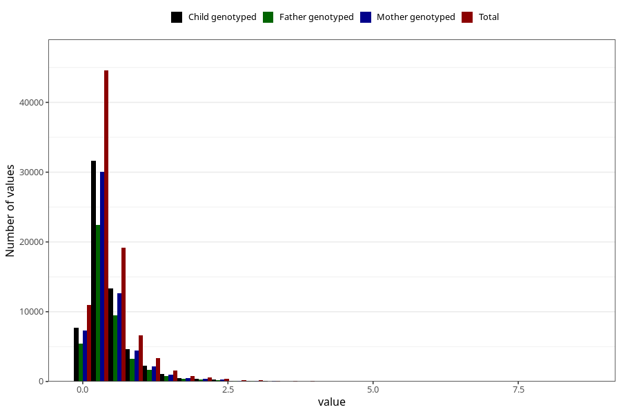

# food_LCn3_g_day
Variable mapping to questionnaire: q2_fatty_acid_iodine, question f_sum_LCn3.
- Number of values:

| Value | Total | Child genotyped | Mother genotyped | Father genotyped |
| ----- | ----- | --------------- | ---------------- | ---------------- |
| Missing | 24927 | 13198 | 12674 | 6238 |
| Non-missing | 88696 | 62233 | 59095 | 43980 |
| 25th percentile | 0.2221 | 0.2219 | 0.22165 | 0.2227 |
| 50th percentile | 0.3571 | 0.3548 | 0.3545 | 0.3554 |
| 75th percentile | 0.5694 | 0.5639 | 0.5625 | 0.561025 |

