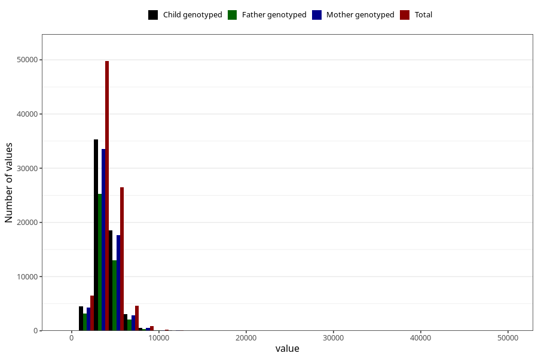

# potassium
Variable mapping to questionnaire: q2_cwd_calculations, question KALIUM.
- Number of values:

| Value | Total | Child genotyped | Mother genotyped | Father genotyped |
| ----- | ----- | --------------- | ---------------- | ---------------- |
| Missing | 24927 | 13198 | 12674 | 6238 |
| Non-missing | 88696 | 62233 | 59095 | 43980 |
| 25th percentile | 3217.8525 | 3215.27 | 3215.11 | 3204.0575 |
| 50th percentile | 3883.69 | 3870.14 | 3869.59 | 3854.46 |
| 75th percentile | 4673.57 | 4647.21 | 4642.78 | 4619.115 |

