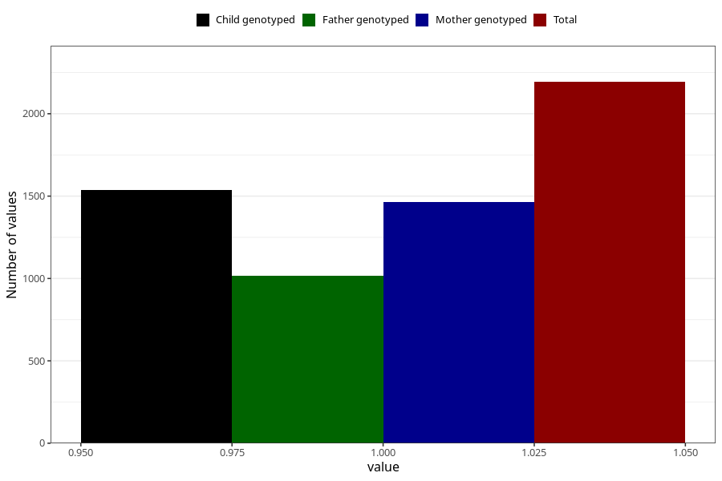

# diarrhoea_13w_16w
Variable mapping to questionnaire: q3, question CC448.
- Number of values:

| Value | Total | Child genotyped | Mother genotyped | Father genotyped |
| ----- | ----- | --------------- | ---------------- | ---------------- |
| Missing | 111430 | 73893 | 70303 | 49204 |
| Non-missing | 2193 | 1538 | 1466 | 1014 |
| 1 | 2193 | 1538 | 1466 | 1014 |

