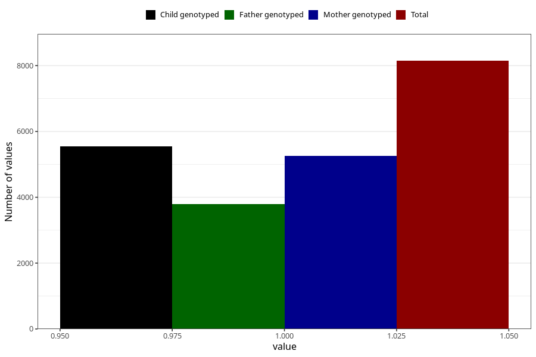

# neck_shoulder_pain_9w_12w
Variable mapping to questionnaire: q1m, question AA208.
- Number of values:

| Value | Total | Child genotyped | Mother genotyped | Father genotyped |
| ----- | ----- | --------------- | ---------------- | ---------------- |
| Missing | 105477 | 69893 | 66520 | 46419 |
| Non-missing | 8146 | 5538 | 5249 | 3799 |
| 1 | 8146 | 5538 | 5249 | 3799 |

