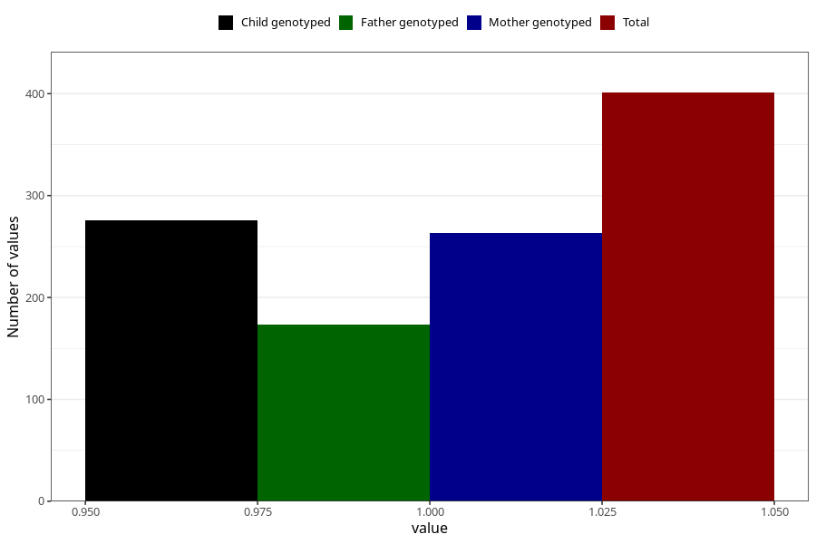

# pneumonia_bronchitis_9w_12w
Variable mapping to questionnaire: q1m, question AA388.
- Number of values:

| Value | Total | Child genotyped | Mother genotyped | Father genotyped |
| ----- | ----- | --------------- | ---------------- | ---------------- |
| Missing | 113222 | 75155 | 71506 | 50045 |
| Non-missing | 401 | 276 | 263 | 173 |
| 1 | 401 | 276 | 263 | 173 |

