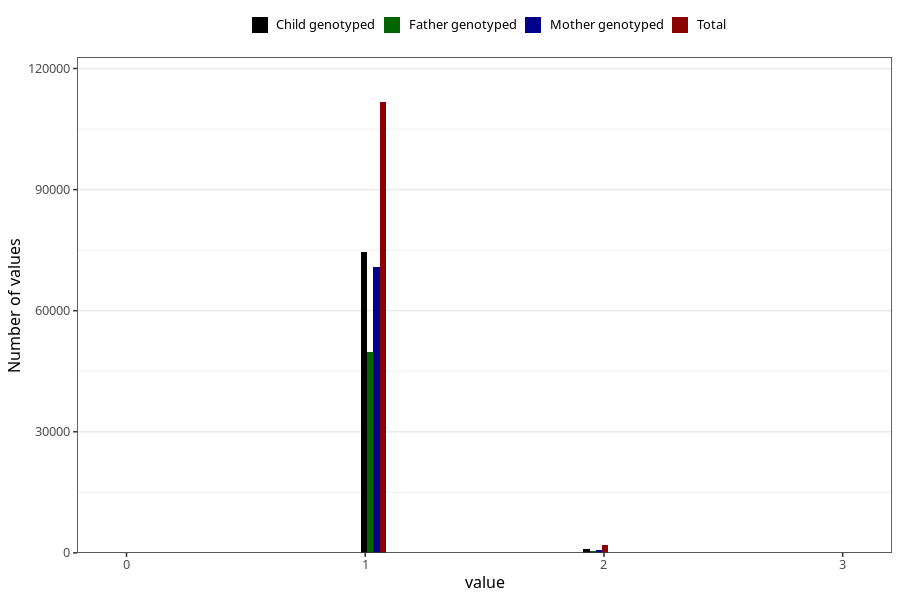

# rank_siblings
Variable mapping to questionnaire: mfr, question BARN_NR; questionnaire: q4, question BARN_NR; questionnaire: q5, question BARN_NR; questionnaire: q6, question BARN_NR; questionnaire: q7, question BARN_NR; questionnaire: q8, question BARN_NR; questionnaire: q9, question BARN_NR; questionnaire: kost_ungdom, question BARN_NR; questionnaire: ungdomsskjema_barn, question BARN_NR.
- Number of values:

| Value | Total | Child genotyped | Mother genotyped | Father genotyped |
| ----- | ----- | --------------- | ---------------- | ---------------- |
| Missing | 0 | 0 | 0 | 0 |
| Non-missing | 113623 | 75431 | 71769 | 50218 |
| 0 | 1 | 0 | 0 | 0 |
| 1 | 111654 | 74571 | 70941 | 49668 |
| 2 | 1947 | 854 | 822 | 549 |
| 3 | 21 | 6 | 6 | 1 |

