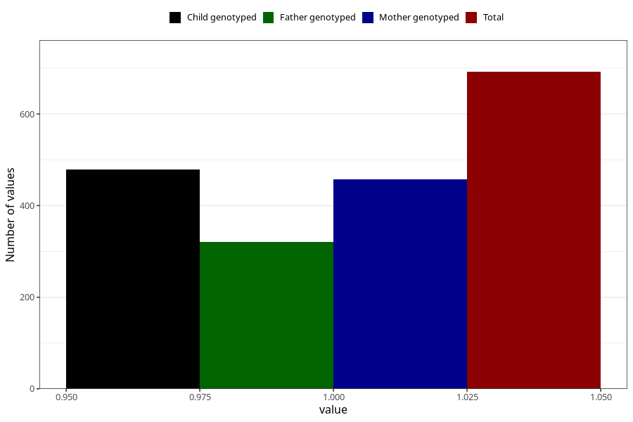

# vaginal_bleeding_2_17w_20w
Variable mapping to questionnaire: q3, question CC325.
- Number of values:

| Value | Total | Child genotyped | Mother genotyped | Father genotyped |
| ----- | ----- | --------------- | ---------------- | ---------------- |
| Missing | 112931 | 74952 | 71311 | 49897 |
| Non-missing | 692 | 479 | 458 | 321 |
| 1 | 692 | 479 | 458 | 321 |

