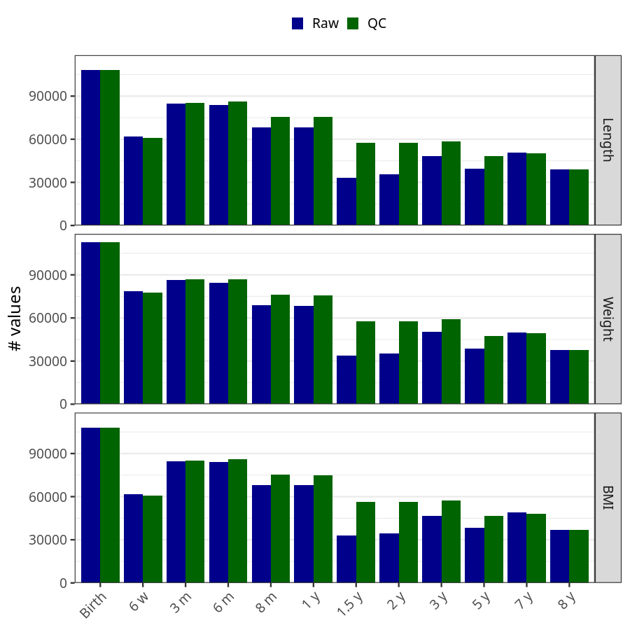
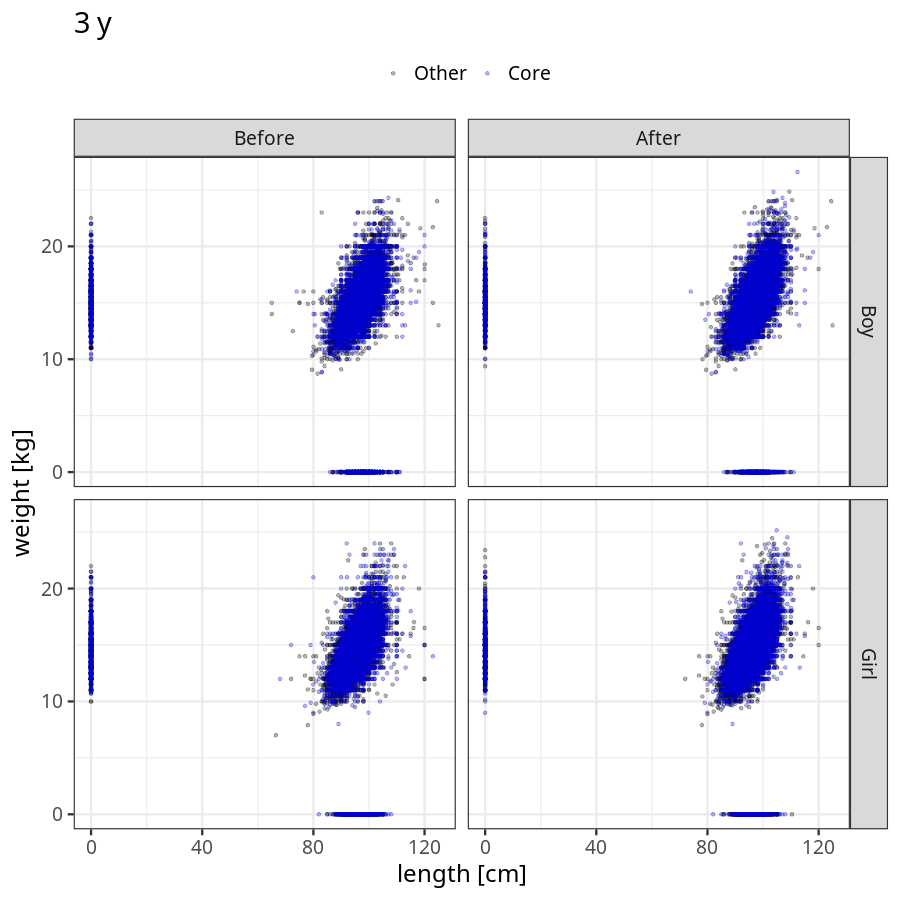
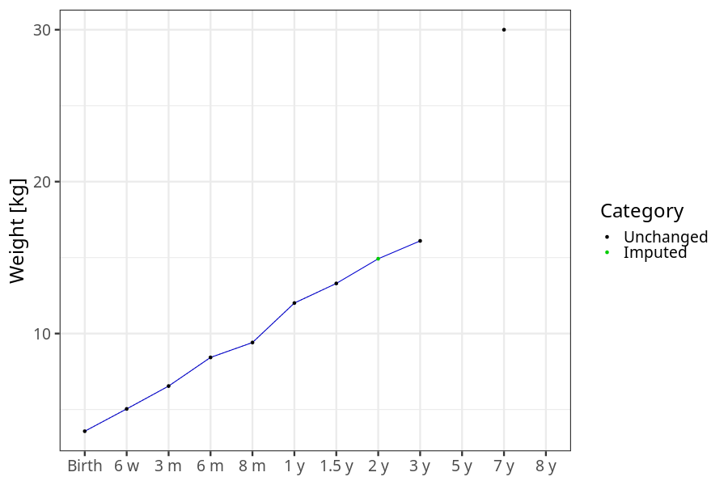
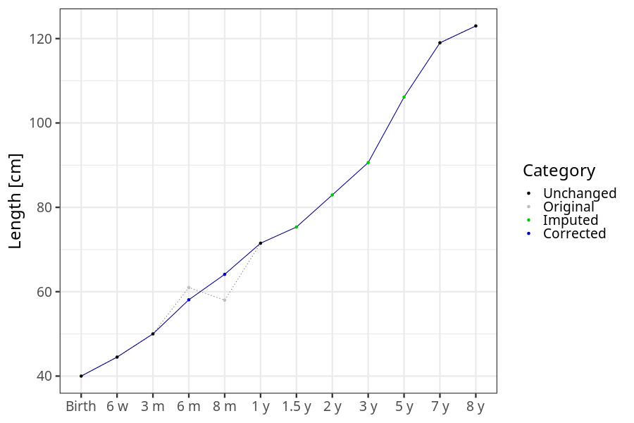
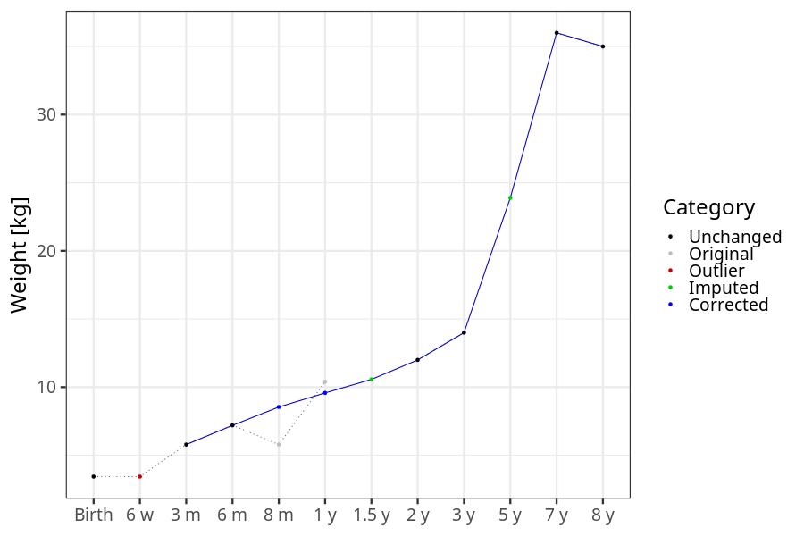

# Phenotypes
### Number of values

### Length vs weight

### Imputation
- Children with no data point altered: 68720
- Children with at least one data point altered: 44903
#### Random example: 33486
> imputed@length_16m imputed@length_2y imputed@weight_16m imputed@weight_2y

#### Random example: 89274
> imputed@length_16m imputed@length_2y imputed@weight_16m imputed@weight_2y

#### Random example: 24168
> imputed@length_16m imputed@length_2y imputed@weight_16m imputed@weight_2y

#### Random example: 14914
> imputed@length_16m imputed@length_2y imputed@weight_16m imputed@weight_2y

#### Random example: 36762
> imputed@length_16m imputed@length_2y imputed@weight_16m imputed@weight_2y

#### Random example: 15627
> imputed@length_16m imputed@length_2y imputed@weight_16m imputed@weight_2y

#### Random example: 25047
> imputed@length_16m imputed@length_2y imputed@weight_16m imputed@weight_2y

#### Random example: 20215
> imputed@length_16m imputed@length_2y imputed@weight_16m imputed@weight_2y

#### Random example: 29150
> imputed@length_16m imputed@length_2y imputed@weight_16m imputed@weight_2y

#### Random example: 1546
> imputed@length_16m imputed@length_2y imputed@weight_16m imputed@weight_2y

#### Random example: 113604
> imputed@length_16m imputed@length_2y imputed@weight_16m imputed@weight_2y

#### Random example: 88696
> imputed@length_16m imputed@length_2y imputed@weight_16m imputed@weight_2y

#### Random example: 70422
> imputed@length_16m imputed@length_2y imputed@weight_16m imputed@weight_2y

#### Random example: 93383
> imputed@length_16m imputed@length_2y imputed@weight_16m imputed@weight_2y

#### Random example: 76574
> imputed@length_16m imputed@length_2y imputed@weight_16m imputed@weight_2y

#### Random example: 54055
> imputed@length_16m imputed@length_2y imputed@weight_16m imputed@weight_2y

#### Random example: 89983
> imputed@length_16m imputed@length_2y imputed@weight_16m imputed@weight_2y

#### Random example: 81229
> imputed@length_16m imputed@length_2y imputed@weight_16m imputed@weight_2y

#### Random example: 58066
> imputed@length_16m imputed@length_2y imputed@weight_16m imputed@weight_2y

#### Random example: 54786
> imputed@length_16m imputed@length_2y imputed@weight_16m imputed@weight_2y

#### Most extreme example (1): 112301
> 

#### Most extreme example (2): 18864
> 

#### Most extreme example (3): 105913
> imputed@length_16m imputed@length_2y imputed@weight_16m imputed@weight_2y

#### Most extreme example (4): 104458
> imputed@length_16m imputed@length_2y imputed@weight_16m imputed@weight_2y

#### Most extreme example (5): 72322
> 

#### Most extreme example (6): 75465
> imputed@length_8m imputed@length_1y imputed@length_16m imputed@weight_8m imputed@weight_1y imputed@weight_16m

#### Most extreme example (7): 80804
> outlier@length_2y imputed@length_2y

#### Most extreme example (8): 110285
> 

#### Most extreme example (9): 91823
> 

#### Most extreme example (10): 82046
> imputed@length_5y imputed@weight_5y

#### Most extreme example (11): 72640
> 

#### Most extreme example (12): 42589
> imputed@weight_6m imputed@weight_8m imputed@weight_16m

#### Most extreme example (13): 536
> imputed@length_16m imputed@length_2y imputed@weight_16m imputed@weight_2y

#### Most extreme example (14): 23060
> 

#### Most extreme example (15): 16794
> 

#### Most extreme example (16): 5186
> outlier@weight_1y imputed@weight_1y imputed@weight_2y

#### Most extreme example (17): 30326
> 

#### Most extreme example (18): 62745
> 

#### Most extreme example (19): 23851
> imputed@length_16m imputed@length_2y imputed@weight_16m imputed@weight_2y

#### Most extreme example (20): 721
> 

