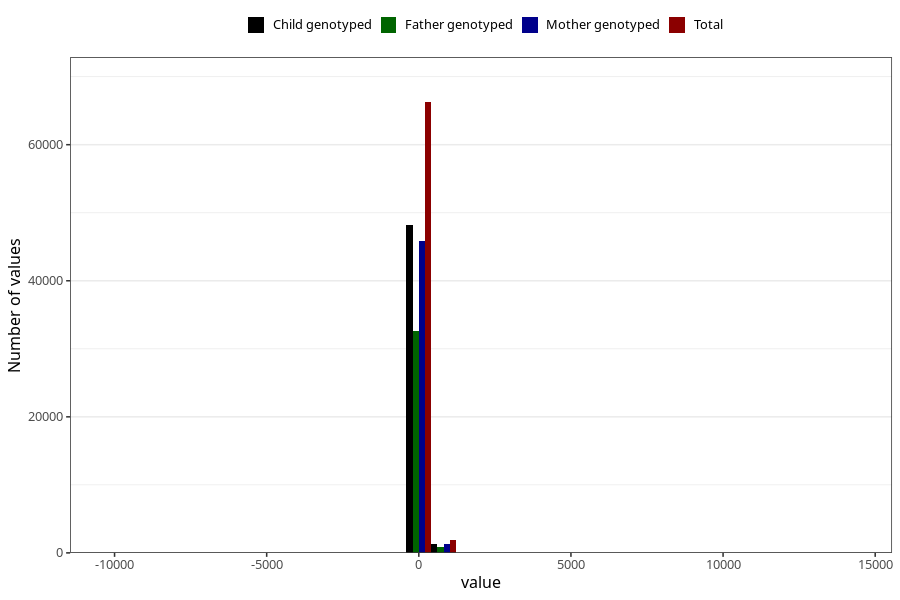

# age_1y
Variable mapping to questionnaire: q5, question Q5_AGE_1_Y.
- Number of values:

| Value | Total | Child genotyped | Mother genotyped | Father genotyped |
| ----- | ----- | --------------- | ---------------- | ---------------- |
| Missing | 45438 | 25883 | 24567 | 16685 |
| Non-missing | 68185 | 49548 | 47202 | 33533 |
| 25th percentile | 363 | 363 | 363 | 363 |
| 50th percentile | 369 | 369 | 369 | 369 |
| 75th percentile | 377 | 377 | 377 | 377 |

