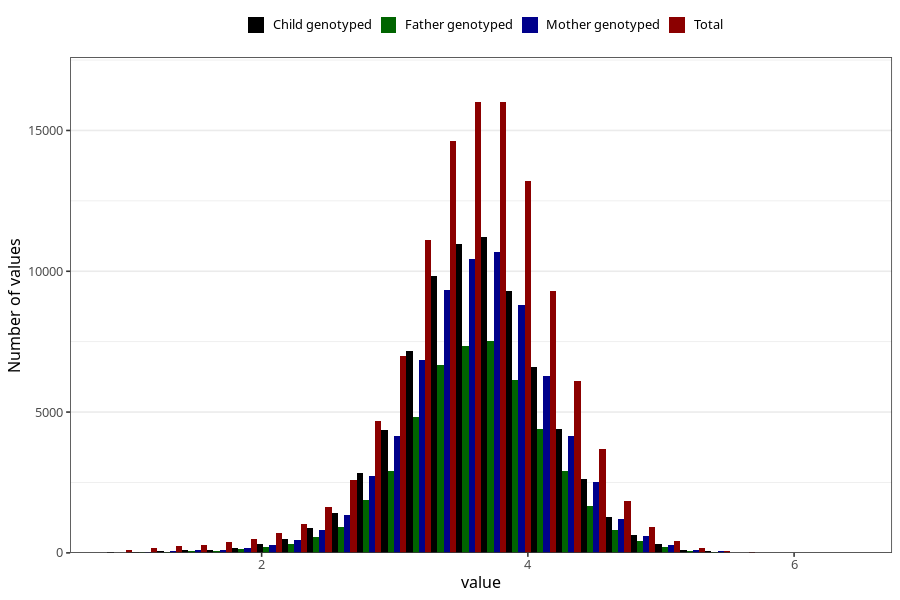

# weight_birth
Variable mapping to questionnaire: mfr, question VEKT.
- Number of values:

| Value | Total | Child genotyped | Mother genotyped | Father genotyped |
| ----- | ----- | --------------- | ---------------- | ---------------- |
| Missing | 875 | 129 | 117 | 87 |
| Non-missing | 112748 | 75302 | 71652 | 50131 |
| 25th percentile | 3.24 | 3.29 | 3.29 | 3.296 |
| 50th percentile | 3.592 | 3.63 | 3.63 | 3.62 |
| 75th percentile | 3.94 | 3.96 | 3.96 | 3.96 |

